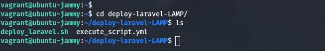

# laravel-with-LAMP-ansible

1. `write up the bash script and ansible playbook to deploy the Laravel application`

Bash script - [bash script](./deploy_laravel.sh) 
Ansible playbook - [ansible playbook](./execute_script.yml)
